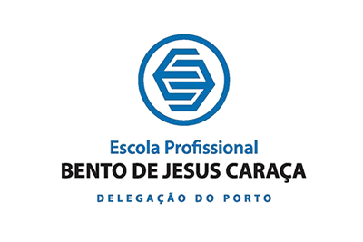

# 📚 Ensino Acadêmico vs Ensino Profissional

Repositório criado para a unidade curricular Tecnologias Internet, do 1.º ano da licenciatura na UMAIA.

Desenvolvido pelo grupo inf24tig01:
- Rodrigo Esteves
- Romeu Pinto
- Tiago Mendes

---

## 📝 Descrição do Tema

Ensino Acadêmico vs Ensino Profissional

Após o 9.º ano de escolaridade, os alunos em Portugal enfrentam uma decisão importante: escolher entre o Ensino Profissional ou o Ensino Académico. Esta escolha influencia não só o percurso educativo, mas também o futuro profissional e académico de cada estudante.

O Ensino Profissional está focado em preparar os alunos para o mercado de trabalho, combinando formação teórica com formação prática, nomeadamente através da Formação em Contexto de Trabalho (FCT). No final, os alunos obtêm uma certificação de nível 4 do Quadro Nacional de Qualificações, equivalente ao 12.º ano, com competências técnicas específicas.

Por outro lado, o Ensino Académico (como os cursos científico-humanísticos) é orientado para quem pretende prosseguir estudos no Ensino Superior, como universidades ou politécnicos. Tem uma abordagem mais teórica e generalista, com foco na preparação para os exames nacionais e acesso ao ensino superior.

Ambos os percursos são válidos e oferecem diferentes oportunidades. A melhor escolha depende dos objetivos, interesses e estilo de aprendizagem de cada aluno.

---

## 📁 Organização do Repositório

| Pasta       | Conteúdo                                 |
|-------------|------------------------------------------|
| `doc/`      | Relatório dividido por capítulos         |
| `doc/images/`| Imagens usadas no relatório ou galeria  |

---

## 🖼️ Galeria de Imagens

| Exemplo 1                         | Exemplo 2                         |
|----------------------------------|----------------------------------|
|          |          |

---

## 💡 Tecnologias / Conceitos Utilizados

- [Markdown](https://www.markdownguide.org/)
- [HTML5](https://developer.mozilla.org/en-US/docs/Web/HTML)
- [CSS3](https://developer.mozilla.org/en-US/docs/Web/CSS)
- [JavaScript](https://developer.mozilla.org/en-US/docs/Web/JavaScript)
- [XML](https://www.w3.org/XML/)
- [XSD (XML Schema Definition)](https://www.w3.org/XML/Schema)
- Outros...

---

## 📖 Estrutura do Relatório

O relatório está dividido nos seguintes capítulos:

- **[Capítulo 1 – Apresentação do Projeto](doc/c1.md)**
- **[Capítulo 2 – Protótipo e Mapa do Site](doc/c2.md)**
- **[Capítulo 3 – Produto Final](doc/c3.md)**
- **[Capítulo 4 – Apresentação Final](doc/c4.md)**

---

## 👥 Equipa

| Nome             | Função                       |
|----------------- |------------------------------|
|Rodrigo Esteves   |index.html (página principal)|
|Rodrigo Esteves   |comparações.html|
|Rodrigo Esteves   |Deploy no Netlify (publicar o site)|
|Rodrigo Esteves   |README .md (documento geral do projeto no GitHub)|
|Rodrigo Esteves   |m3 .md (descrição técnica detalhada)|
|Rodrigo Esteves   |script.js (metade do JavaScript)|
|Romeu Pinto       |percursos.html|
|Romeu Pinto       | formulário.html|
|Romeu Pinto       |dados.xml + schema XML|
|Romeu Pinto       |script.js (metade do JavaScript)|
|Tiago Mendes      |style.css (todo o CSS)|
|Tiago Mendes      |m1 .md (descrição geral do projeto)|
|Tiago Mendes      |m2 .md (sitemap + wireframes)|
|Tiago Mendes      |m4 .md (apresentação)|
